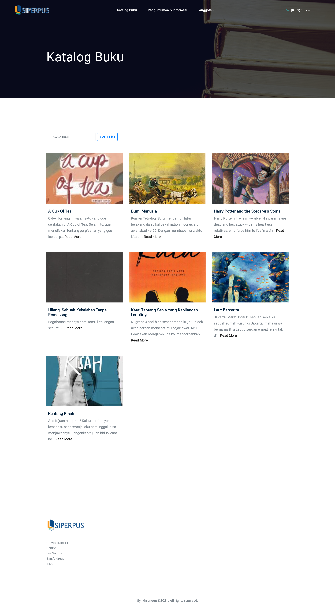
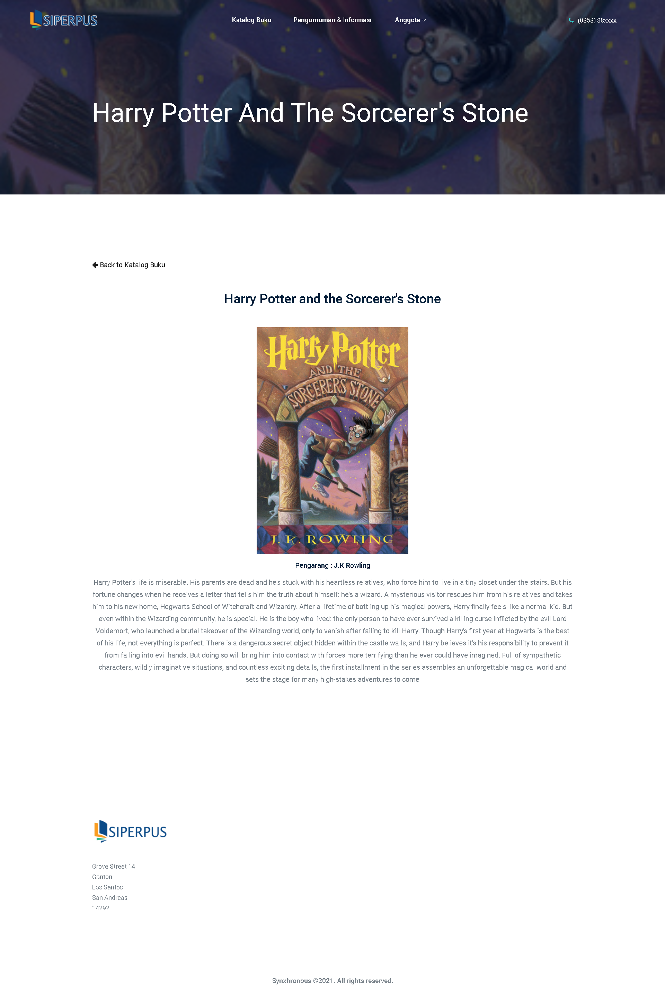
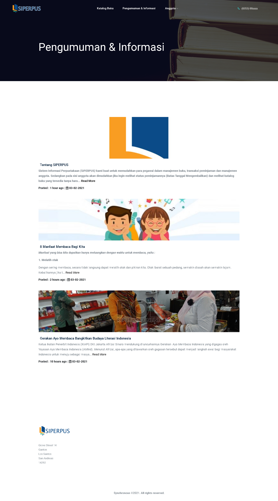
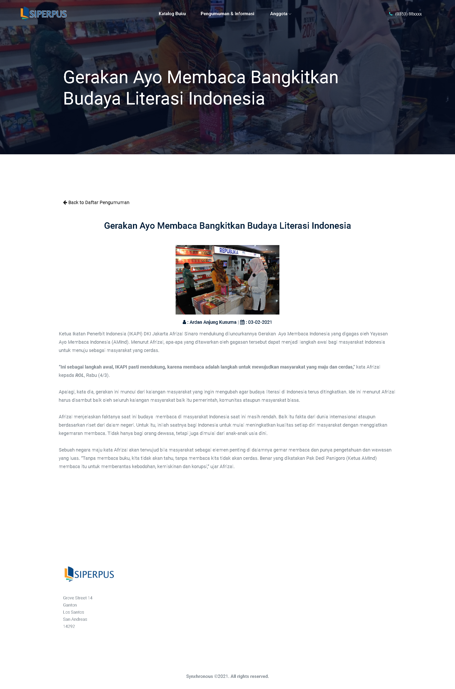
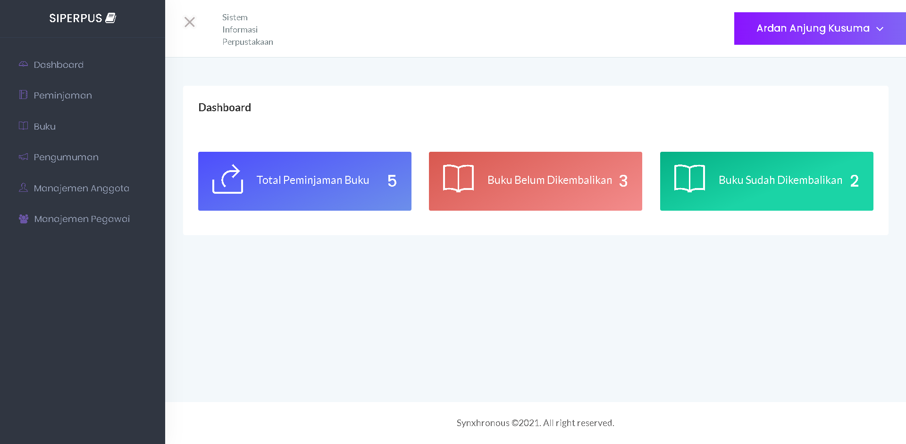
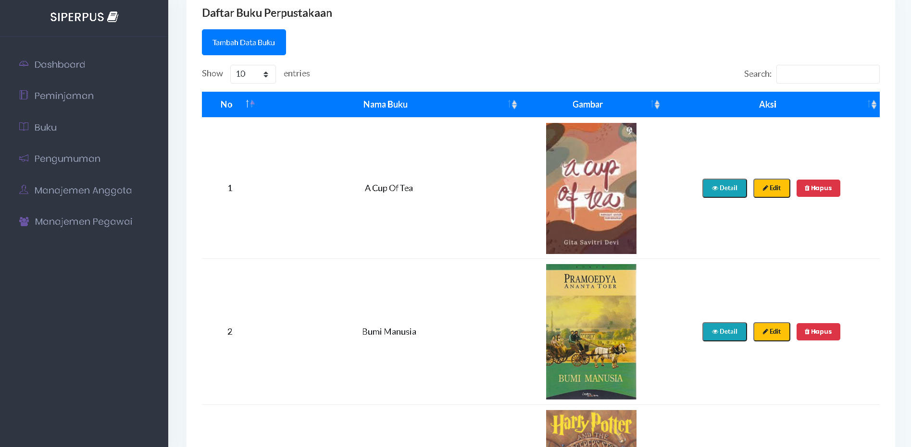
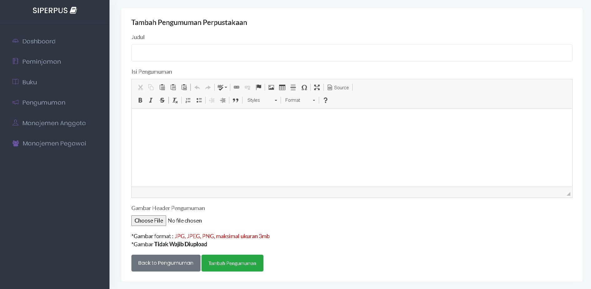
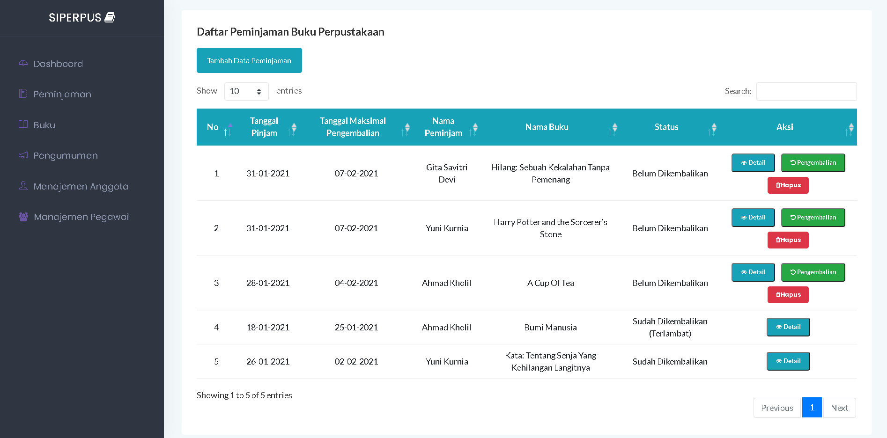
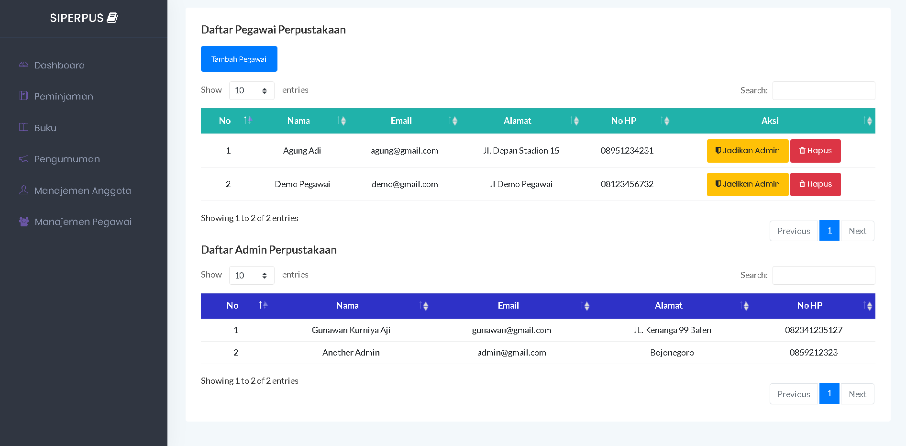

# SIPERPUS :books: :office:

Sistem Informasi Perpustakaan (SIPERPUS) saya buat untuk memudahkan para pegawai dalam manajemen buku, transaksi peminjaman dan manajemen anggota. Sedangkan pada sisi anggota akan dimudahkan jika ingin melihat status peminjamannya (Batas Tanggal Mengembalikan), melihat katalog buku dan informasi atau pengumuman yang tersedia pada website tanpa harus ke perpustakaan.

## Teknologi dan Tool yang digunakan :alien:

-   Laravel 5.8
-   Spatie
-   CKeditor
-   etc

## Screenshot Beberapa Tampilan dan Fitur Website :camera:

1. Homepage

    

2. Katalog Buku

    

3. Detail Buku

    

4. Pengumuman dan Informasi

    

5. Detail Pengumuman & Informasi

    

6. Dashboard Pegawai

    

7. Manajemen Buku

    

8. Tambah Pengumuman (CKEditor)

    

9. Manajemen Peminjaman & Pengembalian

    

10. Manajemen Pegawai (2 User Pegawai Biasa & Admin)

    

---

## License 🌌

-   Copyright © 2021 Ardan Anjung Kusuma

---

**Made with ❤️ by Ardan Anjung Kusuma**
